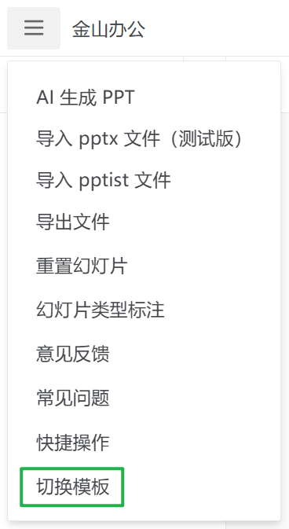
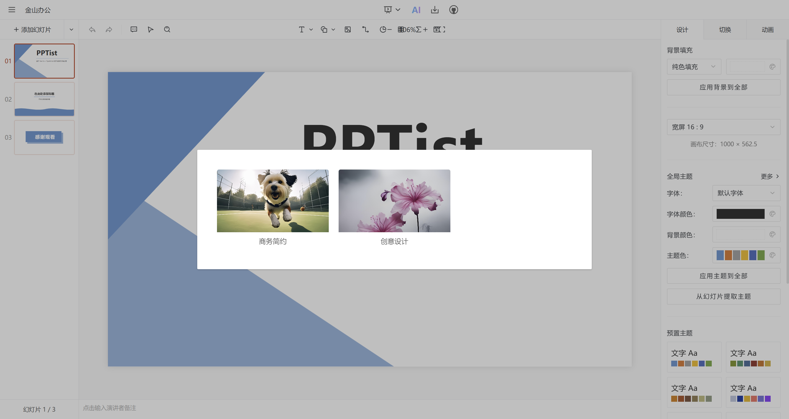

# 1. 如何制作模板数据

通过 PPTist 制作模板，导出 JSON。

# 2. 准备切换模板按钮



```vue
<PopoverMenuItem
  @click="
    () => {
      templateSelectVisible = true
      mainMenuVisible = false
    }
  "
  >切换模板</PopoverMenuItem
>
</template>
<div class="menu-item"><IconHamburgerButton class="icon" /></div>
```

准备控制弹框显示的变量

```vue
<TemplateSelect v-model:visible="templateSelectVisible" />

<script setup lang="ts">
import TemplateSelect from './TemplateSelect.vue'

// ...
const templateSelectVisible = ref(false)
</script>
```

# 3. 准备切换模板弹框

src\views\Editor\EditorHeader\TemplateSelect.vue

```html
<template>
  <Modal :visible="visible" :width="800" title="选择模版" @closed="$emit('update:visible', false)">
    <div class="tmp-list">
      <div class="tmp-item" v-for="template in templates" :key="template.id" @click="handleSelectTemplate(template)">
        <div class="tmp-cover">
          
        </div>
        <div class="tmp-name">{{ template.name }}</div>
      </div>
    </div>
  </Modal>
</template>

<script lang="ts" setup>
import {ref} from 'vue'
import Modal from '@/components/Modal.vue'
import type {Slide} from '@/types/slides'

interface Template {
  id: string
  name: string
  cover: string
  slides: Slide[]
}

// In actual use, it can be obtained from the configuration file or through the API
const templates = ref<Template[]>([
  {
    id: '1',
    name: '商务简约',
    cover: 'http://gips2.baidu.com/it/u=195724436,3554684702&fm=3028',
    slides: [],
  },
  {
    id: '2',
    name: '创意设计',
    cover: 'http://gips1.baidu.com/it/u=1024042145,2716310167&fm=3028',
    slides: [],
  },
  // ...
])

const emit = defineEmits(['update:visible'])
defineProps<{
  visible: boolean
}>()

const handleSelectTemplate = (template: Template) => {
  // Here we handle the template selection logic
  console.log('选择模版:', template)
  emit('update:visible', false)
}
</script>

<style lang="scss" scoped>
.tmp-list {
  display: grid;
  grid-template-columns: repeat(auto-fill, minmax(200px, 1fr));
  gap: 20px;
  padding: 20px;
}

.tmp-item {
  cursor: pointer;
  border-radius: 4px;
  overflow: hidden;
  transition: all 0.2s;

  &:hover {
    transform: translateY(-2px);
    box-shadow: 0 2px 12px rgba(0, 0, 0, 0.1);
  }
}

.tmp-cover {
  width: 100%;
  aspect-ratio: 16 / 9;
  overflow: hidden;

  img {
    width: 100%;
    height: 100%;
    object-fit: cover;
  }
}

.tmp-name {
  padding: 8px;
  text-align: center;
  font-size: 14px;
  color: #666;
}
</style>

```



# 4. 如何应用模板数据

```typescript
import {onMounted, ref} from 'vue'
import Modal from '@/components/Modal.vue'
import type {Slide} from '@/types/slides'
import {useSlidesStore} from '@/store'
// #1 批量导入模版数据
const templateModules = import.meta.glob('@/assets/templates/*.json', {eager: true})
// #2 批量导入预览图
const coverModules = import.meta.glob('@/assets/templates/covers/*.jpg', {eager: true})
interface Template {
  id: string
  name: string
  cover: string
  slides: Slide[]
}

// #3 In actual use, it can be obtained from the configuration file or through the API
const templates = ref<Template[]>()

// #4 处理模版数据
onMounted(() => {
  const templateList: Template[] = []
  Object.entries(templateModules).forEach(([path, module]) => {
    const fileName = path.split('/').pop()?.replace('.json', '') || ''
    const coverPath = Object.keys(coverModules).find(path => path.includes(fileName))

    if (coverPath) {
      templateList.push({
        id: fileName,
        name: fileName.replace('PPT模板', '').replace('PPT模版', ''),
        cover: (coverModules[coverPath] as {default: string}).default,
        slides: (module as {default: {slides: any[]}}).default.slides,
      })
    }
  })
  templates.value = templateList
})

const emit = defineEmits(['update:visible'])
defineProps<{
  visible: boolean
}>()

const handleSelectTemplate = (template: Template) => {
  // #5 Here we handle the template selection logic
  // template => {cover, id, name, slides: [{ background, elements, id }]}
  useSlidesStore().setSlides(template.slides)
  emit('update:visible', false)
}
```

